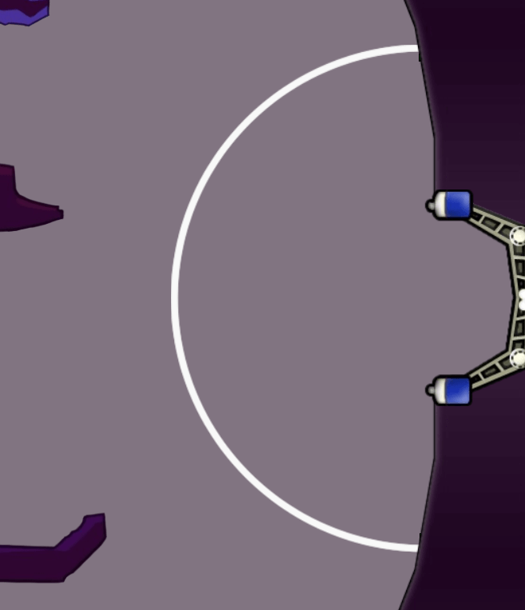

# Goal Validation
The objective here is to dismiss goals that were caused by emping the turrets or lag: dunking or laggy ball throws.

## Penalty Area

In the map, this area is visible to the player (even with `/para false`) and it is enforced by turrets. In the code, it is enforced by dismissing goals that were made from a coordinate inside the arc.
